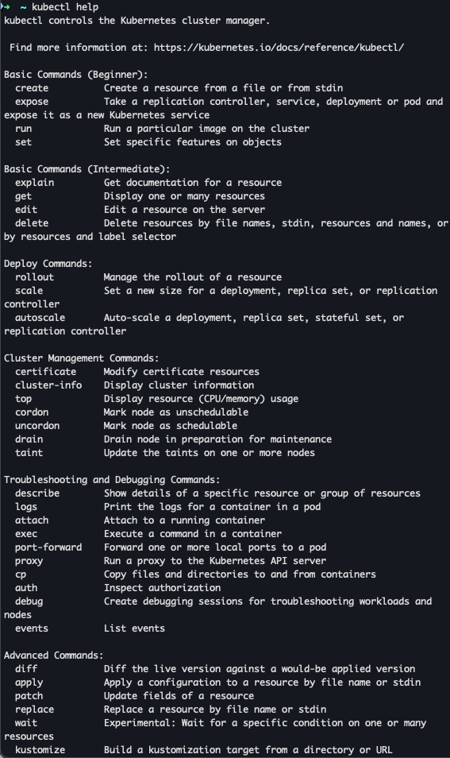
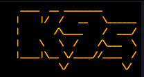
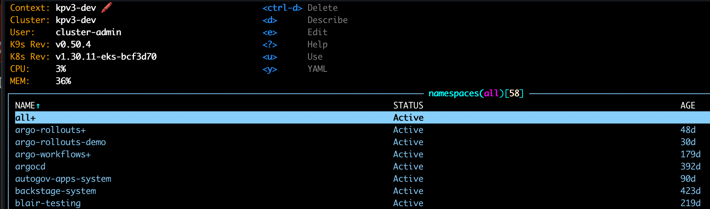
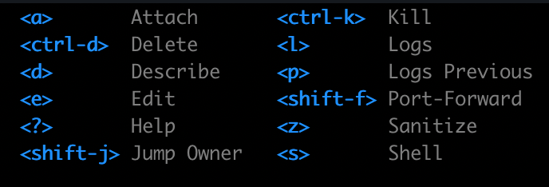
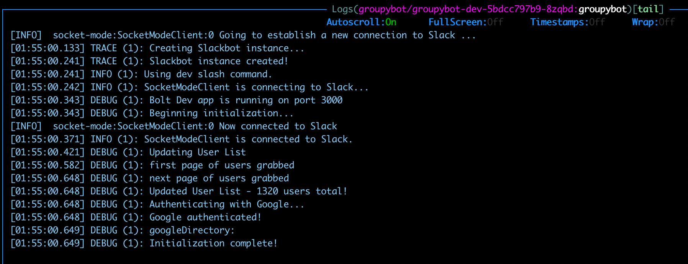
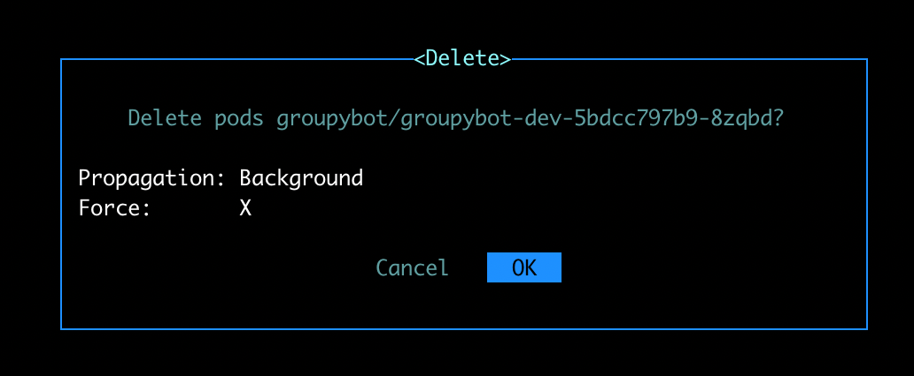
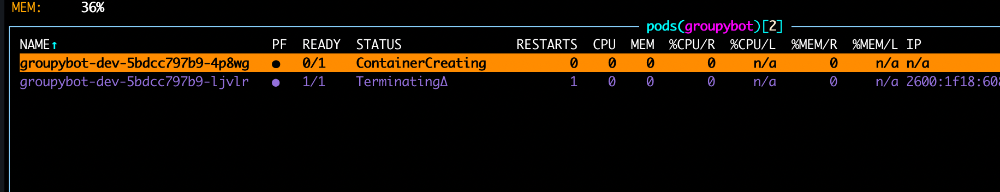
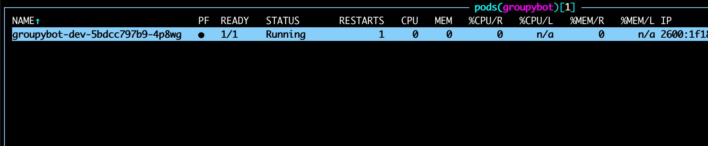

# K9s: a sane way to interact with Kubernetes
By Gibson Smith, 4/30/2025

## Background

This summer, I began learning how to make and manage Kubernetes clusters.  As a newcomer, this means I had to take on the daunting task of learning the `Kubectl` command-line interface.  I had to memorize about a dozen different commands, on top of needing to learn how all of the Kubernetes components are connected and working together.  Needless to say, this definitely led to me feeling **Cognitive Overload**, the amount of information or tasks exceeds a person's ability to process them, leading to confusion or mistakes.

Then, I discovered `K9s`, a terminal UI for Kubernetes that dramatically improves the user experience over Kubectl by giving you a real-time, interactive, and visually organized way to manage your cluster with minimal efforts.

## Goal

My first goal: Use **K9s** to debug a downed service in Kubernetes.

## Interaction

The first thing I did was type `k9s` in my terminal.  This immediately pulled up the TUI (Text-based User Interface).  Already, my instincts of using Kubectl told me I had done something wrong- I forgot to specify which namespace to look in!  Normally, in Kubectl, this will only look at the default Kubernetes namespace, which is almost never used, and can lead to tons of time wasted figuring out where all of my resources went.  Fortunately, K9s took me immediately to the namespaces page, giving me a list of all of the options I had to look at.  Additionally, had I started by looking at a namespace-specific resource, it gives you keybinds to filter to the most common namespaces that you may need.  This forward-thinking design is called **Error Prevention**, a usability heuristic that is characterized by carefully preventing problems from occurring in the first place.

Navigating k9s was a breeze, as it utilizes the **Mental Model**, the understanding a user has of how something works in their head, of other terminal apps, such as `Vim`, `Htop`, and `Ranger`.  For the more specific commands, there are a list of available actions, making the process of finding my app much easier.  This is an example of **Recognition Rather than Recall**, which is the concept of making the user aware of their options without having to spend a significant amount of time with the tool.

When I navigated to the deployment that was acting up, I was able to inspect the manifests that created the app, then analyze the pod that it owned.

After deciding that the best course of action was to destroy the pod and let Kubernetes replace it, I used the keybind to delete the pod.  It gave me a confirmation message to approve the action, as in some situations that could be a potentially dangerous option.

From there, I was able to watch the old pod get terminated, as a new pod was created, and watched as its status changed from creating to running.  This is an example of **Visibility of System Status**, in which the app is constantly giving the user awareness of what it is doing.

## Outcome

Using K9s over Kubectl was a great advancement for how I managed my Kubernetes clusters.  K9s provides a great improvement in **Efficiency** and **Satisfaction**, as it allowed me to work faster and get immediate feedback on the actions I was taking.  Its design is far more appealing than raw CLI commands, which is from its use of **Aesthetic and Minimalist Design**, in which all aspects of the interface are equally interesting and useful.  K9s is an excellent example of implementing UX concepts to benefit its users!
